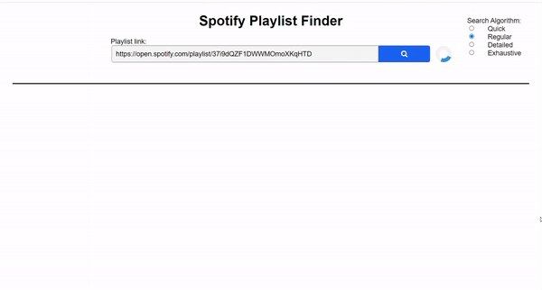

# Similar Spotify Playlists
A website using Python, Flask and Spotify API to find playlists that are similar to your playlist.



## Description
This program utilizes the [Spotipy API](https://github.com/plamere/spotipy), in combination with Google Search, to find similar playlists to an inputted Spotify playlist link. It will return a list of similar playlists with data relating to that playlist. The data includes the playlist art, how many tracks it contains, and how many tracks are shared between itself and the inputted playlist. Found playlists will not always be the same, so you might find some well-made playlists if you're lucky!

## Getting Started
### Dependencies
* Ensure intended browser of use is updated to most recent version. We recommend using either Google Chrome or Mozilla Firefox.
* Python version is the latest installed.
* pip version is the latest installed.
```
python -m pip install --upgrade pip
```

### Installation
Create a new folder and run the following commands in terminal:
``` 
git clone https://github.com/e-chenxu/Similar-Spotify-Playlists.git

cd Similar-Spotify-Playlists
```

Now that you are inside the main directory, please install the included packages:
```
pip install -r requirements.txt
```

To add your Spotify API token in environment variables refer to the site:
```
https://spotipy.readthedocs.io/en/2.6.3/
```

### Execution
Assuming all packages and dependencies are installed correctly, the program will run normally and display in [localhost](http://localhost:8000).
```
python3 app.py
```
Open localhost, then put your playlist link in and search!

## Authors and Contributors
[Eric Chen Xu](https://github.com/e-chenxu) <br>
[Johnson Dinh](https://github.com/jdinh-782)